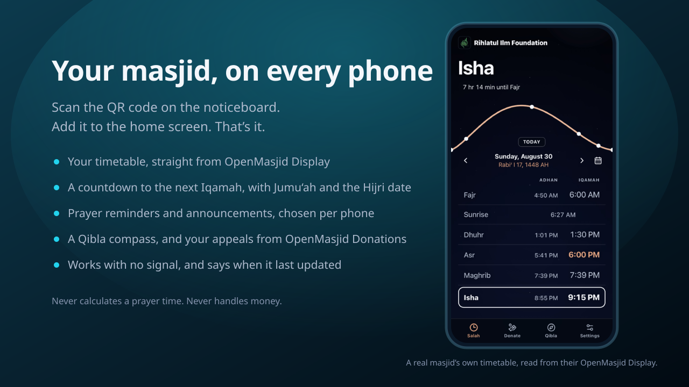

<!-- SPDX-License-Identifier: AGPL-3.0-only -->
<!-- Copyright (C) 2026 OpenMasjid-Solutions -->

<h1 align="center"><b>OpenMasjid Companion</b></h1>

<p align="center"><i>Prayer times and giving, on every musalli's phone.</i></p>

<p align="center">
  <a href="#what-it-does">What it does</a> |
  <a href="#how-it-works">How it works</a> |
  <a href="#what-it-needs">What it needs</a> |
  <a href="#install">Install</a> |
  <a href="#license">License</a>
</p>

---

> **Status: v0.2.0, on the stable channel.** The app is listed in the OpenMasjid catalog and
> installable from **OpenMasjidOS → App Store** on the default (stable) channel. Release notes for
> each version are on the [releases page](https://github.com/OpenMasjid-Solutions/OpenMasjidCompanion/releases),
> and [`CHANGELOG.md`](CHANGELOG.md) is what is in a build today.
>
> **Before you install, one honest caveat.** The prayer times come from OpenMasjid Display's
> `timetable` capability, and that capability is on Display's **dev** channel — it has not landed
> in a stable Display release yet (stable is v0.69.0). On an all-stable box Companion installs and
> opens, but it has nothing to read and says so plainly rather than inventing times. To see it
> work end to end, put **both** apps on the Development channel.

**OpenMasjid Companion** is an app for
[OpenMasjidOS](https://github.com/OpenMasjid-Solutions/OpenMasjidOS) that puts the masjid in a
musalli's pocket. Put a QR code on the noticeboard; anyone who scans it gets your prayer timetable
on their phone, and can add it to their home screen like an app — no app store, no account, nothing
to sign up for.

It runs in **one container** on the masjid's own machine, alongside the rest of OpenMasjidOS.

<p align="center">
  
</p>

## Acknowledgements

Created by **Hasan Ismail**, with immense help from **Qari Ijaz** and **Osman Sayed**.

<div align="center">
  <table>
    <tr>
      <td align="center">
        <a href="https://github.com/hasan-ismail">
          <br />
          <sub><b>Hasan Ismail</b></sub>
        </a>
      </td>
      <td align="center">
        <a href="https://github.com/ijazshare">
          <br />
          <sub><b>Qari Ijaz</b></sub>
        </a>
      </td>
      <td align="center">
        <a href="https://github.com/osayed0001">
          <br />
          <sub><b>Osman Sayed</b></sub>
        </a>
      </td>
    </tr>
  </table>
</div>

Resources for this project were generously sponsored by **[An-Noor Institute](https://www.annoorusa.org/)**, **[Rihlatul Ilm Foundation](https://rifusa.org/)**, and **[AsmaTec Inc.](https://asmatec.com/)**.

<div align="center">
  <table>
    <tr>
      <td align="center">
        <a href="https://www.annoorusa.org/">
          <br />
          <sub><b>An-Noor Institute</b></sub>
        </a>
      </td>
      <td align="center">
        <a href="https://rifusa.org/">
          <br />
          <sub><b>Rihlatul Ilm Foundation</b></sub>
        </a>
      </td>
      <td align="center">
        <a href="https://asmatec.com/">
          <br />
          <sub><b>AsmaTec Inc.</b></sub>
        </a>
      </td>
    </tr>
  </table>
</div>

### Design inspiration
 
The musalli-facing side of this app owes a real debt to
**[Pillars](https://www.thepillarsapp.com/)** — an ad-free, privacy-focused prayer app built by
Muslims. We used it, loved it, and took a lot from how it presents a prayer day: the calm prayer
list, the day and night treatments, and the general refusal to clutter a religious app. Companion
is not affiliated with Pillars and shares no code with it; the debt is one of taste. Jazākum Allāhu
khayran to the team behind it.

May Allah reward everyone who made it possible.

---

## What it does

- **Your timetable, not a calculated one.** Today, this week and this month come straight from
  **[OpenMasjid Display](https://github.com/OpenMasjid-Solutions/OpenMasjidDisplay)**, so the times
  on a phone are the same times that are on the wall — including any Iqamah change you have
  scheduled, on the day it takes effect.
- **A countdown to the next Iqamah**, with Jumu'ah, the Hijri date, and a page that looks like the
  time of day — dark before Fajr, light by mid-morning, dark again after Maghrib. Laid out to be
  read one-handed in a dark prayer hall.
- **Works with no signal.** The last timetable it fetched stays on the phone, and it says plainly
  when it was last updated rather than guessing.
- **Optional prayer reminders.** A musalli chooses which prayers to be notified about, at the Adhan
  or a few minutes before the Iqamah. Per device, per person. The masjid sees a count, never a list.
- **Announcements.** Type a notice — a funeral, a closure, a changed Iqamah — and it reaches every
  phone that has not turned notices off, with your masjid's name on it. It asks you to confirm
  first, because it cannot be taken back. One can also be set to send itself: once on a date, every
  day, or on chosen days at a chosen time, on your masjid's own clock.
- **A Qibla compass**, from the phone's own location — which never leaves the phone and is never
  stored.
- **Your appeals, in the app.** Paste the share link of any appeal from
  **[OpenMasjid Donations](https://github.com/OpenMasjid-Solutions/OpenMasjidDonations)** and it
  appears as a tile with its progress. Tapping **Donate** opens your Donations page to give.
- **Your contact details**, at the top of Settings — phone, email, address, website, and links to
  WhatsApp, Instagram, Facebook, X, YouTube or Telegram. Fill in as much or as little as you like;
  anything blank is simply not shown.
- **A QR code and a printable poster**, generated for you, pointing at your real public address.
  The QR points at a page that walks people through installing it, which knows which phone and
  browser is reading it — including what to do when *Add to Home Screen* is missing from an
  iPhone's Share sheet, and what to do if the link was opened inside WhatsApp or Instagram.
- **"Who's using it"** in the admin panel: how many phones opened the app in the last month, iPhone
  or Android, and how many opened it from their **home screen** rather than a browser — the number
  that tells you whether the poster worked. It counts phones, never people, and forgets after 90
  days.

### Two things it deliberately does not do

- **It never calculates a prayer time.** No calculation method, no astronomy library, no "fallback"
  when Display is unreachable. Display owns prayer-time correctness in this family of apps and this
  app only *reads* from it. If it has nothing, it says so — a wrong prayer time confidently shown
  to a whole congregation is the worst thing this app could do.
- **It never handles money.** No card fields, no payment setup, no amounts collected. Giving happens
  on your Donations page; this app reads public appeal information and links out to it.

## How it works

```
 A musalli's phone  ──HTTPS via your Cloudflare tunnel──▶  OpenMasjid Companion (one container)
                                                                │
                                        ┌───────────────────────┴──────────────────────┐
                                        │                                              │
                    OpenMasjidOS Fabric (server-to-server, on your LAN)      your Donations page
                                        │                                     (public appeal info)
                                        ▼
                              OpenMasjid Display  ── your prayer timetable
```

The phone only ever talks to Companion. Companion's **backend** reads your timetable from Display
through the platform's app-to-app broker, reads your appeals from your Donations page, caches both,
and serves the caches. If either is unavailable, that part of the app degrades to an honest state —
it never takes the app down and it never invents anything.

## What it needs

- **OpenMasjidOS** with the app installed from the catalog.
- **OpenMasjid Display**, with a timetable set up and the `timetable` capability available. That
  capability ships in **Display v0.70.0**, which is **not released yet** — it is on Display's dev
  channel today, and stable Display is v0.69.0. Without it Companion has no prayer times and says
  so; it never falls back to calculating them.
- **Remote access turned on** in OpenMasjidOS → Settings → Remote access, with this app shared.
  This one is not optional: an installable app, push notifications and a QR code all need a public
  HTTPS address, and none of them can work from an address inside your building. Until it is on,
  the admin panel blocks on that step and the public page hides install and notifications rather
  than offering buttons that cannot work.
- **OpenMasjid Donations** — only if you want appeals in the app. Everything else works without it.

## Install

Through **OpenMasjidOS → App Store**, once the app is listed. There is nothing to fill in at
install; the platform will ask one question — whether to share the app over the internet — and
everything else is set up inside the app afterwards.

Running it by hand is possible for development (`docker compose up -d --build`), but without
OpenMasjidOS there is no Fabric, so there is no timetable to read and no public address to publish.

## Development

See [`CONTRIBUTING.md`](CONTRIBUTING.md). In short:

```bash
cd server && npm ci && npm run build && npm run typecheck:tests && npm test
cd web    && npm ci && npm run build && npm test && npm audit --audit-level=high
```

All development happens on the **`dev`** branch; `main` is what masjids install.
[`CLAUDE.md`](CLAUDE.md) is the full specification this app is built against.

## License

**AGPL-3.0-only** — see [`LICENSE`](LICENSE). This app is reached over a network by people who
never installed it, which is exactly what AGPL §13 is about: every page carries a link back to this
source.

Contributions are governed by the **Contributor License Agreement**
([`CLA.md`](CLA.md)) — you sign once, automatically, on your first pull request. The CLA keeps the
public tree AGPL-3.0 while letting OpenMasjid-Solutions also offer commercial/dual licences; you
keep your copyright. Details in [`CONTRIBUTING.md`](CONTRIBUTING.md).
